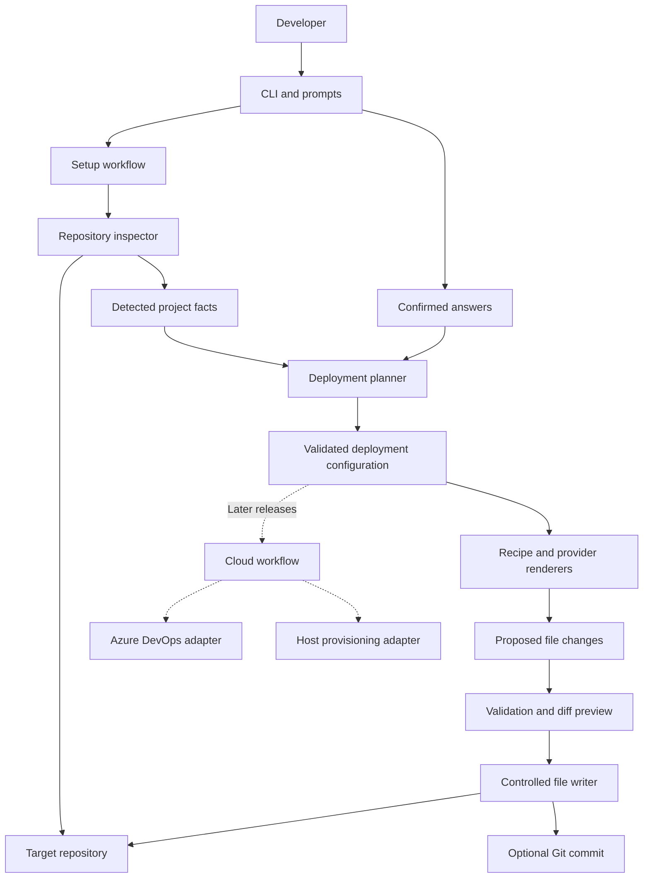
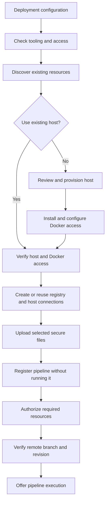

# ashokify: high-level design

Current workflow: Ashokify generates deployment files once and keeps no saved answers or tracking manifest. Configuration persistence and regeneration sections below describe the earlier design; [IMPLEMENTATION.md](IMPLEMENTATION.md) and [../README.md](../README.md) describe the current behavior.

Status: the local MVP is implemented. [IMPLEMENTATION.md](IMPLEMENTATION.md) records its decisions and verification; cloud workflows below remain planned.

Date: 7 September 2026.

Requirements and audit evidence: [SCOPE.md](SCOPE.md).

## 1. Purpose

Ashokify is an interactive CLI that prepares a repository for deployment using the conventions currently applied manually by Ashok. Developers run `npx ashokify` inside their project, confirm detected settings, review generated files and optionally commit the changes.

The MVP prepares Vite static frontends for Azure DevOps. Later releases will configure external resources and execute deployments. The implementation is one TypeScript CLI package with separate modules for inspection, prompts, planning, generation and external operations.

This document defines the architecture. At design time, the repository contained only a minimal Bun entry point, TypeScript configuration and `@clack/prompts`. The local preparation workflow is now implemented.

## 2. Scope and decisions

| Concern | MVP decision |
| --- | --- |
| Pipeline provider | Azure DevOps enabled; AWS visible but disabled as coming soon. |
| Application type | Vite static frontend. React, Vue and other UI frameworks use the same deployment recipe. |
| Node build version | Respect `package.json.engines.node`; use Node 22 when absent. Confirm the resolved version. |
| Serving | Developer-owned choice. No default `nginx.conf`, Nginx image or Nginx Dockerfile instructions. |
| Host sharing | Independent projects may share an EC2 host and have their own Nginx setups. Do not change another project's serving configuration. |
| Environment model | Explicit branch-to-environment mapping, reused throughout generated files. |
| Repository mutation | Clean worktree required; preview changes before applying; offer one commit afterwards. |
| Cloud operations | Generate configuration and list prerequisites. No resource creation or pipeline execution by the MVP CLI. |
| Distribution | npm package runnable with `npx ashokify`, without requiring Bun on the user's machine. |

SSR, backend applications, automatic infrastructure provisioning, secure-file upload and pipeline registration/execution are outside the MVP implementation. They remain part of the product architecture.

The generated Azure YAML can contain deployment steps for a fully specified container setup. Running that pipeline is separate from generating its files.

## 3. System structure



The planner and renderers operate on data. They do not prompt, access credentials, write files or contact cloud services. The workflow owns the order of operations and delegates side effects to small adapters.

Start with an internal registry of supported providers and deployment recipes. A public plugin framework, hosted backend and database are unnecessary for the MVP.

### Component responsibilities

| Component | Responsibility |
| --- | --- |
| CLI | Parse command arguments, display prompts and progress, handle cancellation, return useful exit status. Use the existing Clack dependency. |
| Setup workflow | Coordinate preflight, inspection, configuration, preview, validation, writing and optional commit. |
| Repository inspector | Discover Git root, application directory, package metadata, build scripts, lockfiles, Vite configuration and environment variable names. Return evidence and uncertainties. |
| Deployment planner | Combine detected facts with confirmed answers. Resolve names, branch mappings, serving choices and required external resources. |
| Vite recipe | Describe build inputs and output. Generate Docker build configuration and public environment templates without assuming React, Vue or a web server. |
| Azure pipeline renderer | Convert the deployment configuration into YAML with explicit branch mappings, build/publish steps and applicable deployment steps. |
| File planner and writer | Classify creates, updates, unchanged files and conflicts; preserve unrelated content; apply the approved set. |
| Validators | Check configuration, generated documents and cross-file consistency; report local validation separately from cloud readiness. |
| Git adapter | Inspect worktree/index, detect concurrent changes, stage the approved paths and create the optional commit. |
| Future cloud adapters | Inspect and manage service connections, secure files, pipeline definitions and hosts after explicit user choices. |

## 4. Configuration model

Persist nonsecret answers in `ashokify.config.json`. This gives reruns a stable source of defaults and separates user decisions from template implementation.

| Group | Information |
| --- | --- |
| Versioning | Configuration schema version and deployment template version. |
| Application | Relative application directory, display name and normalized deployment identifier. |
| Build | Recipe identifier `vite-static`, package manager/version, Node engine constraint, selected Node image/version, build script, output directory and CPU architecture. |
| Pipeline | Provider `azure-devops`, YAML path and registry service-connection reference. |
| Registry | Login server, image repository and image tagging policy. |
| Environments | Full branch name, unique environment identifier, public environment file, secure override reference and Docker-host connection reference when applicable. |
| Serving | Deferred/external serving or configured container serving; confirmed image/command, asset destination, ports and networks as needed. |
| Connectivity | Existing host assumptions and optional Tailscale secure-file reference. |

Pipeline provider, registry and hosting provider are separate concepts. Choosing Azure DevOps must not imply an Azure VM. A later configuration can combine Azure DevOps, Azure Container Registry and AWS EC2.

Application name, Azure DevOps project name, Azure repository name and image repository are distinct fields. For example, an application called `customer-portal` can live in a repository called `frontend` inside a differently named DevOps project.

Do not persist authentication tokens, passwords, certificate contents or private environment values in this configuration. Machine-specific upload paths belong to a later local execution session, not the committed configuration.

## 5. MVP workflow

### Preflight and inspection

Before the first prompt, locate the Git root and require a clean worktree and index, including non-ignored untracked files, conflicts and submodule changes. Ignored local files can exist, but must not be silently overwritten or included as build inputs. Show blocking paths and exit without stashing, resetting or deleting anything.

Inspect the selected application directory without running its scripts, importing executable configuration or installing its dependencies. A missing Git repository or unreadable manifest produces a specific error.

The MVP handles one application per invocation. If invoked at an ambiguous monorepo root, identify candidate directories and request one or explain how to rerun in the application directory. Shared workspace builds requiring files outside that directory are unsupported until a workspace recipe exists.

### Prompt sequence

1. Select provider: Azure DevOps enabled; AWS disabled with a coming-soon label.
2. Confirm detected Vite static frontend and package manager. Enter accepts. Rejection or unknown detection opens the manual deployment-type selector. Unsupported types remain visible and disabled.
3. Select trigger branches: `main`, `staging` and `develop` initially checked. Accept optional comma-separated additional branches, trim and deduplicate, then show the final list. Require at least one branch for the MVP.
4. Confirm project name: saved configuration, then package name, repository name, directory name. Keep it editable and display the derived deployment identifier.
5. Confirm registry: default `sifars.azurecr.io`; collect image repository and registry service-connection name separately.
6. Confirm build settings: package manager, Node build version, build script, output directory and target architecture.
7. Choose serving and deployment settings. Ask only for fields needed by that choice, including host connections, network/port settings and optional VPN references.
8. Confirm environment variable names, branch mappings and whether secure overrides are required.
9. Show the proposed files, diffs and remaining external prerequisites. Obtain confirmation before writing.
10. After generation and local validation, offer a single commit. Declining leaves generated changes unstaged.

Cancellation before application leaves the repository unchanged. The generation workflow has no dependency on Azure CLI installation or login.

### Stack and Node detection

Reuse the relevant shadcn detection logic behind a local adapter, as proposed in [SCOPE.md](SCOPE.md#reuse-shadcns-detection-with-clear-limits). Vendor only the required portion, preserve attribution and record the upstream revision. Do not import private paths from the installed shadcn package. Selecting the exact revision is an implementation task.

Detect Vite and confirm static output. Framework identity does not select a different Docker template. Known server-build indicators produce an unsupported-type result; ambiguous cases require developer confirmation rather than a claim that static deployment is guaranteed. [Vite documents static output and SSR separately](https://vite.dev/guide/static-deploy).

Use `engines.node` to constrain the build version. A range such as `>=22` is not a valid Docker image tag. Prefer Node 22 if it satisfies the declared range, otherwise select a compatible supported version; ambiguous or unsupported constraints require correction. If no Node constraint exists, propose Node 22. Save the confirmed selection so reruns do not silently change it. Validate compatibility with the selected build tooling during build verification. [npm documents engine ranges](https://docs.npmjs.com/cli/v11/configuring-npm/package-json/#engines).

Identify the package manager from explicit package metadata and lockfiles. Conflicting evidence requires confirmation. Use that package manager's reproducible installation mode and preserve its lockfile. Do not change the target project's package manager, build script or quality gates to make generation easier.

## 6. Serving and generated pipeline behavior

Building static files and serving them are separate decisions. Ashokify must not select Nginx, another server or a host port implicitly.

| Developer choice | Generated behavior | Readiness |
| --- | --- | --- |
| Existing external serving or serving deferred | Build and publish static output as an artifact. A Docker build/output target may export the files without a web-server stage. Document the expected artifact destination and developer-managed delivery. | Build preparation complete; serving/delivery remains external or pending. |
| Configured serving container | Build an image using the confirmed serving image/command and asset destination, publish it and generate Compose deployment steps. Preserve an existing compatible Dockerfile or show explicit edits. | Repository configuration complete; external connections and host readiness still need verification. |
| Nginx explicitly selected | Add Nginx-specific files or Docker stages only when the developer requests them. Apply only to this application's configuration. | Same external prerequisites as other container setups. |

Choosing an external server does not automatically establish how files reach it. Arbitrary host file transfer is outside the MVP. The artifact handoff must make this outstanding work visible instead of generating a deployment stage that cannot serve the application.

The Azure renderer selects one of two outputs:

- Static artifact workflow: select environment, prepare public build values, build, publish static artifact.
- Container workflow: select environment, prepare build values, build and publish image, publish deployment metadata, then deploy that exact image using the specified host connection.

Optional Tailscale steps apply only to a selected deployment path that requires them. Do not include GitHub mirroring or OPAD-specific staging exclusions by default.

### Branch and image identity

Use one explicit mapping to generate triggers, environment filenames, resource references, image labels and deployment conditions. Match full branch refs rather than relying on the last path segment exposed by `Build.SourceBranchName`. Azure documents both values in its [predefined variables](https://learn.microsoft.com/en-us/azure/devops/pipelines/build/variables?view=azure-devops).

Normalize an environment identifier for filesystem/container usage and reject collisions. For example, `feature/payments` must remain distinct from `release/payments`. Every selected branch gets a valid mapping; do not silently treat UAT as main or skip staging.

For container workflows, use a unique build identifier for the published image and carry its exact reference into deployment metadata. Branch tags can be convenience aliases; deployment must not resolve an unrelated `latest` image. Never reuse a build tag for a different image.

Keep build and runtime Compose inputs explicit. Build uses the base file plus the build override; deployment uses the runtime file and selected image metadata, with rebuilding disabled. Compose can merge overrides automatically, so relying on implicit discovery can introduce build configuration into deployment. [Docker documents Compose file merging](https://docs.docker.com/compose/how-tos/multiple-compose-files/merge/).

### Shared EC2 hosts

Scope Compose project names and networks to the application and environment. Prefer Compose-managed container names over globally fixed names. Shared networks require explicit selection. Host port bindings are optional and explicit; routing through an existing proxy may not need a host binding.

The MVP validates its configuration but cannot prove that a remote port is free. Later host checks must verify port availability and resource ownership. Never run host-wide cleanup or replace another project's Nginx, certificates or routing configuration.

## 7. Files and environment handling

| File | Purpose and ownership |
| --- | --- |
| `ashokify.config.json` | Versioned, nonsecret deployment choices. |
| `azure-pipelines.yml` | Generated pipeline for the chosen build/serving mode. Existing custom YAML requires explicit adoption or conflict resolution. |
| `Dockerfile` | Confirmed build/output targets and optional serving target. No Nginx by default. |
| `docker-compose.yml` | Runtime service configuration for container mode. Omit when no runtime container is configured. |
| `docker-compose.override.yml` | Build inputs for container mode, including arguments and architecture. |
| `.env.example`, `.env.build.<environment>` | Public variable names, intentional public defaults and placeholders. Preserve existing values unless explicitly changed. |
| `.gitignore`, `.dockerignore` | Merge required exclusions while retaining existing rules and exceptions. |
| `DEPLOYMENT.md` | Explain generated behavior, exact external resource names, validation status and pending setup. |
| `.ashokify/manifest.json` | Track managed file paths, template version and last generated hashes for conflict detection. Exclude the manifest's own hash. |

Additional helper scripts are generated only if required by the selected recipe and included in the preview and manifest. `nginx.conf` is a conditional file, never part of the default file set.

Separate public frontend settings from pipeline credentials. Scan environment examples and source for variable names; do not automatically copy private local `.env` values into committed files. A required variable with no value is a visible placeholder, and execution must fail clearly if it remains unresolved.

At build time, combine the branch's public values with its explicitly configured secure override using defined override precedence. Pass only approved frontend keys to the build. Do not shell-source arbitrary environment files or pass registry/VPN credentials as frontend build arguments.

If overrides are disabled, emit no secure-file download task. If required, a missing or unauthorized file is a prerequisite failure. Avoid the audited pattern of treating download as optional and then unconditionally reading the missing file.

Do not publish the merged private environment file as a release artifact. Publish only allowlisted deployment metadata such as image reference and environment identifier. Values exposed through Vite become browser-visible regardless of whether they originally came from an Azure Secure File. [Vite environment documentation](https://vite.dev/guide/env-and-mode).

## 8. File application, idempotency and commits

The file planner produces an ordered change set with path, operation, expected current hash, proposed content and explanation. The writer accepts only this reviewed set.

On first use, absent files are created. Existing equal files remain unchanged; ignore files receive minimal merges. Existing custom deployment files are conflicts unless the user explicitly agrees to a proposed replacement or adoption. Never overwrite an existing file merely because its name matches a template.

On reruns, compare current content with the last generated manifest. Files unchanged since generation can be updated. Developer modifications produce a conflict for review. Configuration/template upgrades are explicit; the same configuration and template version must produce the same bytes and no empty commit. Removed environments or obsolete managed files must appear as proposed deletions, not disappear silently.

Before writing, recheck Git HEAD, index and worktree against the initial snapshot. Stage proposed files in a temporary directory, run structural validation, then apply them with expected-content checks. Individual file replacement can be atomic; a multi-file change is not. Retain enough temporary backup information to recover from partial failure and restore only paths still matching the content written by this invocation. Preserve concurrent user edits and report any remaining recovery work.

After applying, offer `chore(deploy): configure Azure DevOps frontend deployment`. Recheck HEAD, index and changed paths, then stage only the approved files. Any unrelated changes stop automatic committing. A changed HEAD requires a fresh review. Do not use `git add .`, bypass hooks or push automatically.

If the user declines, leave files unstaged. If Git identity or a commit hook fails, retain the generated changes, explain what failed and report the actual index state. An uncommitted previous run is a dirty worktree on the next fresh invocation and must be resolved first.

## 9. Validation and errors

Structural validation runs before writing. Docker validation, when available, uses temporary fixtures or copies. Report whether a check passed, failed or was not run; missing Docker must not be described as a successful container build. Release tests must exercise real builds even when the local CLI only performs structural validation.

| Failure | Expected behavior |
| --- | --- |
| Dirty repository or concurrent edits | List paths; stop without overwriting or committing unrelated work. |
| Unknown/unsupported application | Offer the supported manual choice or cancellation before generation. |
| Invalid branch/name/engine constraint | Show a field-specific correction and return to that prompt. |
| Conflicting generated file | Show the conflict and require resolution; no silent replacement. |
| Invalid generated YAML or inconsistent mapping | Abort before application and identify the affected output. |
| Missing optional validation tool | Mark the check not run and explain how to run it later. |
| Build validation failure | Report failure; do not claim deployment readiness or automatically commit. |
| Missing cloud prerequisites | Complete local preparation where valid and list pending requirements. |
| Git commit failure | Preserve generated work and explain how to retry. |

Messages should identify the failed operation, cause and next action. Do not print secret values in command previews or logs. Pass user-derived identifiers as arguments or serialize them into YAML/JSON; do not concatenate them into shell commands.

## 10. Future cloud workflow

The cloud workflow consumes the same deployment configuration but has its own execution state. Repository file generation stays independent of cloud credentials and availability.



Steps are conditional on the selected mode. For example, an artifact-only build does not need a Docker-host connection. The CLI may ask about creating a connection before provisioning, but it cannot finalize a new host connection before the endpoint and authentication material exist.

### Integration boundaries

- Azure DevOps adapter: check organization/project access, inspect existing resources, create/reuse service connections, upload secure files, register pipelines, authorize resources and queue selected runs. Use supported Azure CLI commands and authenticated DevOps APIs where needed.
- Host adapter: inspect or provision hosts independently of the pipeline provider. AWS EC2 is a later implementation requiring its own AWS account credentials, region and resource choices.
- Bootstrap adapter: install and configure the supported host environment, authenticated Docker access and selected networking. The audited installation script is an input, not a complete bootstrap.
- Execution state store: retain nonsecret resource IDs, configuration fingerprint and step outcomes locally. Reconcile with actual cloud state before resuming. Store credentials in the provider's supported credential system, never in the committed config.

Check whether the CLI exists, whether the DevOps extension is installed, and whether a read against the chosen project succeeds. Do not gate DevOps access solely on `az account show`. Distinguish authentication failure, denied permission, missing/inaccessible resources and network errors. Successful reads do not prove permission to create resources.

Creating a connection or uploading a file is separate from authorizing the pipeline to use it. Microsoft documents [service connections](https://learn.microsoft.com/en-us/azure/devops/pipelines/library/service-endpoints?view=azure-devops) and [secure-file authorization](https://learn.microsoft.com/en-us/azure/devops/pipelines/library/secure-files?view=azure-devops).

Each mutating step gets a concrete preview and the user's consent. Reuse existing resources only after checking their identity and configuration. A matching name alone is insufficient. A skipped prerequisite blocks dependent steps; a failed step retains completed resources and offers a resumable path. Never automatically delete a shared host or connection as rollback.

Before offering a run, ensure the selected remote branch contains the required generated files and resources are ready. A local commit does not update Azure Repos. Push remains a separate user action or explicitly accepted step. Pipeline registration must suppress any default first-run behavior.

## 11. Packaging and module layout

Use TypeScript and the existing Bun development toolchain, while keeping the distributed executable compatible with Node. Publish built JavaScript and bundled templates through the npm `bin` entry. The current Bun shebang and Bun-only engine metadata need adjustment during implementation so `npx ashokify` does not require a separate Bun installation. [npm executable packaging](https://docs.npmjs.com/cli/v11/configuring-npm/package-json/#bin).

The CLI's supported Node version is separate from the Node version selected for the target application's Docker build. Test the packaged executable with Node alone. Do not publish development-only files or require users to compile TypeScript.

Proposed source organization:

```text
src/
  cli/                 Command entry, prompts and presentation
  workflows/           Local setup and later cloud setup
  inspection/          Repository, Vite and package-manager detection
  config/              Configuration schema and normalization
  planning/            Deployment model and proposed changes
  recipes/vite-static/ Build/output and selected serving behavior
  providers/azure/     Pipeline renderer; cloud adapter added later
  adapters/            Filesystem, Git and process execution
  validation/          Configuration and generated-output checks
templates/             Versioned bundled templates
tests/fixtures/        Representative target projects
docs/                  Scope, HLD and implementation notes
```

Proposed first command: `npx ashokify`, with `--cwd` for selecting an application directory and `--help`/`--version`. Additional unattended or cloud commands can be introduced when their workflows are implemented. Unsupported options must not appear executable merely because they exist in a provider list.

## 12. Delivery and verification

Implement the MVP in these increments:

1. Package entry point, Git preflight and cancellation behavior.
2. Repository inspection, prompt flow and validated saved configuration.
3. Vite build/output recipe, developer-selected serving and Azure pipeline rendering.
4. Preview, managed-file conflict detection, controlled writing and optional commit.
5. Packaged CLI and deployment-fixture verification, followed by release preparation.

Required verification covers:

- React and Vue static Vite fixtures selecting the same deployment recipe.
- Node engine constraints, Node 22 fallback, custom output directory and conflicting lockfiles.
- All default/custom branch combinations, including names containing slashes and normalized-name collisions.
- No Nginx files or instructions in default output; explicit Nginx selection isolated to the selected project.
- Artifact-only mode publishing static files without claiming a running deployment.
- Container mode using the exact published image and excluding build overrides during deployment.
- Missing secure overrides, public/private variable separation and absence of credentials in artifacts.
- Dirty worktrees, cancellation, existing-file conflicts, identical reruns, concurrent edits and commit-hook failures.
- Independent projects sharing a host without shared configuration or port ownership assumptions.
- A packed npm executable running on Node without Bun installed.

No cloud writes are required to author this HLD. Integration runs against Azure or AWS belong to a separately authorized implementation validation stage.

## 13. Remaining implementation decisions

The scope decisions above are settled. The low-level design still needs the exact template contents, configuration schema, chosen shadcn source revision, supported package-manager versions and detailed serving-input validation.

Before implementing host provisioning, establish the missing certificate/bootstrap procedure. The supplied Docker script installs packages but does not configure the authenticated Docker endpoint observed in Preston. The prior audit also could not determine whether empty service-connection lists in other projects represented missing resources or restricted visibility. Preserve that uncertainty in future discovery errors.
